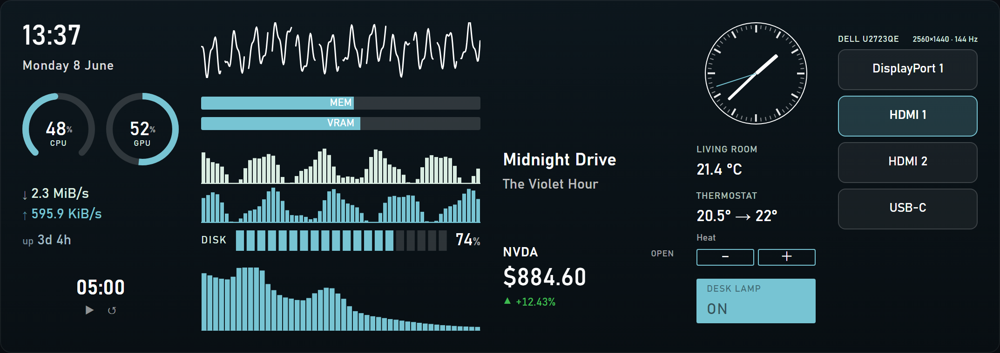
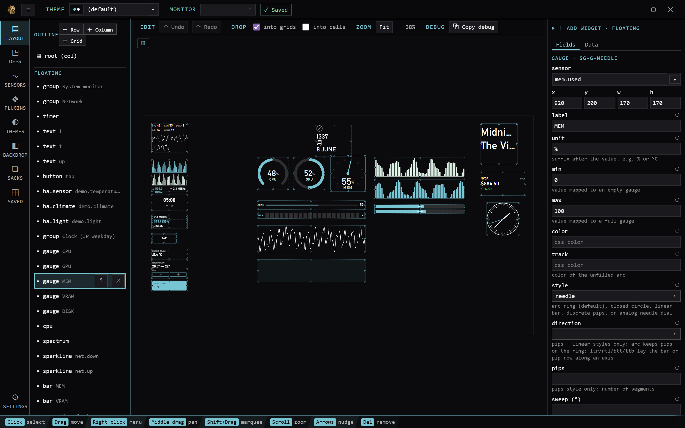

#  widgetsack

<p align="center">
  
</p>

[**👉 installer download for the latest release**](https://github.com/gyng/widgetsack/releases/latest)

A themable desktop widget overlay for Windows.

Put system meters (CPU, per-core, GPU/VRAM, memory, network), clocks, and the currently-playing track on a transparent, click-through overlay across all your monitors and arrange them with a
built-in visual editor. Widgets follow a sensor + meter model but the layout is a live CSS-flow editor, styling is plain CSS + design
tokens, and it ships with Home Assistant, MQTT, and stock-quote integrations.

## Widget gallery

See: [**widget reference**](docs/widgets.md) · [**templating & formulas**](docs/templating.md) · [**theming**](docs/theming.md)

The screenshots regenerate from the registry: `npm run gen:gallery` (in `client/`); both reference
docs regenerate from the code with `npm run gen:docs`.

## Layout studio

<p align="center">
  
</p>

## Features

- **Widgets:** gauges, bars, sparklines, text, digital + analog clocks, a month calendar, a per-core
  CPU grid, a GPU panel, a battery indicator, a disk/storage panel, a top-process monitor, an audio
  spectrum, a now-playing card, a weather card, a stock ticker, an application fence or zone, a web
  iframe, action buttons, a DDC monitor input switcher, an audio output switcher, and Home Assistant
  tiles — sensor- or [formula-driven](docs/templating.md)
  and fully restylable ([reference](docs/widgets.md)).
- **Sensors:** CPU (total/per-core/freq), memory + swap, network, disks (+ I/O), uptime, battery, the
  busiest process (by CPU/RAM/disk/GPU), and NVIDIA GPU (NVML) — demand-gated, so only what's on screen
  is sampled.
- **Now playing:** Windows media via GSMTC — Spotify, foobar2000, browsers, and more
  ([support table](https://github.com/ModernFlyouts-Community/ModernFlyouts/blob/main/docs/GSMTC-Support-And-Popular-Apps.md)).
- **Integrations:** Home Assistant (live states + light/climate/fan/cover/lock/scene/switch/media
  controls), MQTT, stock quotes, and
  weather (Open-Meteo, keyless).
- **Overlay:** transparent, click-through, always-on-top, one per monitor — per-widget
  click-through still lets buttons/controls catch clicks. Single-instance, optional autostart.
- **Studio:** visual editor — drag/resize/snap a CSS-flow layout, browse sensors, build reusable
  widgets, edit themes, import/export "sacks". `Ctrl+Alt+E`; live-reloaded `widgets.json`.
- **Templates:** one-click starter groups (clock, system, network, now-playing) recreated from
  classic Rainmeter skins.
- **Macros:** bind a button to a sequence of actions (HA service calls, media transport).
- **Plugin packages:** drop-in template/theme bundles from the community — declarative, opt-in,
  scanned ([authoring guide](docs/third-party-plugins.md)).
- **Theming:** per-widget CSS (highlighting/linting editor), design-token themes (one for every
  monitor, or a different theme per monitor), system fonts.
- **Window zones:** define snap regions and drag any app's window — including custom-titlebar apps
  like Electron/UWP — into them, or auto-arrange open windows by rule.
- **Perfect for secondary and side monitors**: Corsair Xeneon Edge, Lamptron, Turzx, etc.
- Built with Tauri + React.

## Coming from Rainmeter?

widgetsack is a web-first take on what a widget suite does — system meters, clocks, now-playing, and a transparent always-on-top overlay — with a few differences:

- **Higher memory usage**: as this is a web and browser-based overlay each monitor with active widgets will take a minimum of 100MB of RAM and 40MB of VRAM
- **Sensor + meter instead of `.ini`:** the same measure→meter idea (a sensor feeds a meter), but you
  wire it in a visual **studio** instead of hand-editing config files. Layout is CSS flexbox and
  styling is plain per-widget CSS + design tokens.
- **Built-in skins as templates:** the bundled templates recreate classic skin layouts and drop in
  with one click; build your own reusable widgets in the widget designer.
- **Built-in sources:** beyond local system sensors, pull in Home Assistant, MQTT, and live stock
  quotes.
- **Layout containers**: Grids, rows, columns and floating widgets that use HTML and CSS for styling

## Usage

Download the installer from the [latest release](https://github.com/gyng/widgetsack/releases/latest).

The overlay starts passive (click-through). To arrange widgets:

1. **Enter edit mode** — the tray icon's **"Edit layout"**, or press **`Ctrl+Alt+E`**.
2. Drag widgets to move, drag the handles to resize. Use the **palette** (bottom-left) to
   add widgets and the **inspector** to edit a selected widget's sensor / position / config.
3. **Exit edit mode** the same way. The layout saves to `widgets.json` (in the app config
   dir) and reloads automatically if you hand-edit that file.

### Theming

Each widget can take a CSS override. Eg, to turn images grayscale:

```css
img {
  filter: grayscale(1);
}
```

### Now playing — source priority

If multiple audio sources are active, a priority list of executable names decides which to
show (reachable in edit mode; "All media" lists the current sources).

### Autostart

Toggle autostart in settings, or add `widgetsack.exe` to Startup apps in Task Manager.

## Plugins

widgetsack has two plugin layers, both managed from the studio's **Plugins** section:

- **Built-in integrations** — Home Assistant, MQTT, stock quotes, and the AI provider are
  first-party plugins configured in the studio. Tokens and API keys stay in the Rust backend;
  the webview never holds them.
- **Third-party plugin packages** — drop-in community bundles that add **templates**
  (ready-made widget clusters with insert-time options), optionally a **theme**, and optionally
  a **sandboxed sensor source**: a small `source.js` that polls an HTTP API and feeds custom
  sensors you can bind to any meter or formula as `pkg.<id>.*`.

Install a package by dropping its folder into the app-config `plugins/` directory, or via
**Plugins → Packages → Install from URL…** — paste `owner/repo`, a GitHub link, or any https
`plugin.json` URL. Update checks are manual (per-package *Check updates*); nothing is fetched in
the background.

Packages are opt-in and sandboxed by design:

- **Nothing runs on install.** Every package lands disabled; enabling it is a per-machine
  allowlist, and re-installing starts from zero trust.
- **Templates and themes are declarative data** — a package can't ship its own components. The
  only code surface is `source.js`, which runs in a QuickJS-in-WASM sandbox with zero
  capabilities: no network, no DOM, no Tauri, a ~100 ms CPU budget per tick.
- **The host does the fetching** against a Rust-enforced https allowlist of exact hostnames the
  manifest declares — consented by name on first enable, re-confirmed if an update changes the
  list.
- **Theme CSS is the trust boundary:** it's scanned (remote `url()`/`@import`, viewport
  overlays), and a flagged theme asks for explicit confirmation. Don't enable packages from
  sources you don't trust.

To write one, see the [authoring guide](docs/third-party-plugins.md) and the reference
[sample pack](examples/packages/sample-pack) — a parameterized clock template, a weather card
driven by a sandboxed [open-meteo](https://open-meteo.com) source, and a small theme, CI-tested
against the real pipeline on every build.

## Development

Build/run instructions, the test gates, and the release process live in
[docs/development.md](docs/development.md). The architecture and roadmap are in
[docs/widget-platform.md](docs/widget-platform.md).

## License

Licensed under either of

- Apache License, Version 2.0 ([LICENSE-APACHE](LICENSE-APACHE) or
  <http://www.apache.org/licenses/LICENSE-2.0>)
- MIT license ([LICENSE-MIT](LICENSE-MIT) or <http://opensource.org/licenses/MIT>)

at your option.

Unless you explicitly state otherwise, any contribution intentionally submitted
for inclusion in the work by you, as defined in the Apache-2.0 license, shall be
dual licensed as above, without any additional terms or conditions.

<p align="center">
  
</p>
