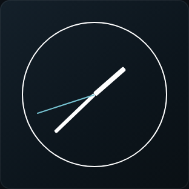
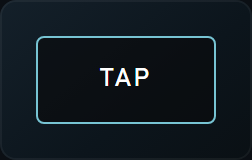
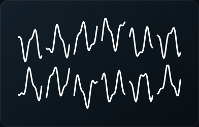
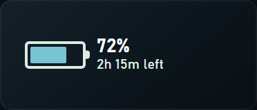
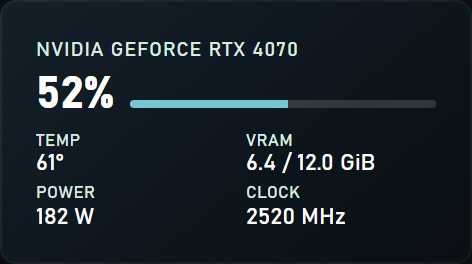
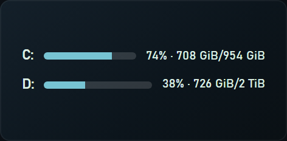
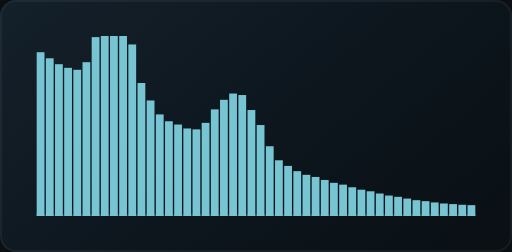
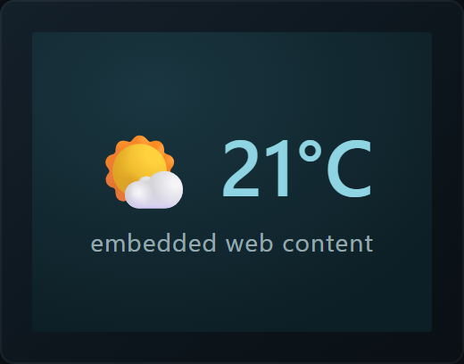
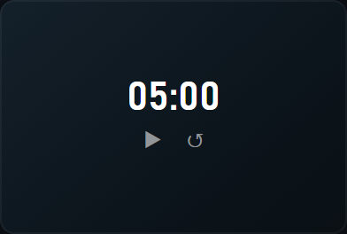

# Widget reference

> **Generated** from the widget registry — do not hand-edit. Run `npm run gen:docs` (in `client/`)
> to regenerate, or click **Copy widget reference** in the studio's Widget designer. Source of truth:
> `client/src/lib/core/widget.ts` (built-ins) + plugin metas.

This lists every shipped widget **type** and its config schema, so an agent can author layouts
directly. Edit any node's full JSON/YAML in the studio Inspector's **Data** tab (it applies via the
`replaceNode` op), or build up the layout JSON below.

## Layout shape

A monitor layout is `{ root, floating }`:

- **root** — the in-flow tree: nested **containers** `{ id, kind: "row" | "col" | "grid", children: [...], gap?, pad?, align?, justify? }`.
- **floating** — **leaves** placed by an absolute `rect` (escape the flow).

A **leaf** wraps one widget instance:

```json
{ "id": "gauge-1", "unit": { /* WidgetInstance */ }, "basis": "content" | { "fr": 1 }, "halign": "fill", "valign": "fill" }
```

A **WidgetInstance** (`leaf.unit`):

```json
{ "id": "gauge-1", "type": "gauge", "rect": { "x": 0, "y": 0, "w": 110, "h": 110 },
  "sensor": "cpu.total", "config": { "label": "CPU", "min": 0, "max": 100 }, "css": "/* optional per-instance css */" }
```

- `type` picks the widget (see below). `sensor` binds a sensor id (omit for self-sourcing types).
- `config` holds the type's fields (see each widget's table). `basis: { fr }` grows along the parent axis; `"content"` hugs content; a number/omitted is a fixed/auto size.
- Sensor ids are listed in the studio **Sensors** section (e.g. `cpu.total`, `mem.used`, `gpu.util`, `net.down`, `ha.<entity_id>`).

## Widgets

### Gauge — `gauge`


Gauge for one scalar sensor (default 0–100%): arc ring, full circle, linear bar, pips or needle dial.

- **Sensor:** binds a `scalar` sensor (default `cpu.total`)
- **Default size:** 110×110

| key | type | default | options / range | description |
| --- | --- | --- | --- | --- |
| `label` | text | "CPU" |  |  |
| `unit` | text | "%" |  | suffix after the value, e.g. % or °C |
| `min` | number | 0 |  | value mapped to an empty gauge |
| `max` | number | 100 |  | value mapped to a full gauge |
| `color` | color |  |  |  |
| `track` | color |  |  | color of the unfilled arc |
| `style` | select | "arc" | `arc`, `circle`, `linear`, `pips`, `needle` | arc ring (default), closed circle, linear bar, discrete pips, or analog needle dial |
| `direction` | select | "arc" | `arc`, `ltr`, `rtl`, `btt`, `ttb` | pips + linear styles only: arc keeps pips on the ring; ltr/rtl/btt/ttb lay the bar or pip row along an axis |
| `pips` | number | 10 | min 3, max 40, step 1 | pips style only: number of segments |
| `sweep` | number | 270 | min 90, max 360, step 15 | arc/pips/needle styles: arc span in degrees (180 = semicircle); the gap stays centred at the bottom |
| `value` | expr |  | → number | overrides the sensor, e.g. round(mem.used, 0) or cpu.total / 2 |
| `minExpr` | expr |  | → number (sets `min`) |  |
| `maxExpr` | expr |  | → number (sets `max`) |  |

### Bar — `bar`


Linear progress bar for one scalar sensor; horizontal or vertical.

- **Sensor:** binds a `scalar` sensor (default `mem.used`)
- **Default size:** 140×16

| key | type | default | options / range | description |
| --- | --- | --- | --- | --- |
| `label` | text | "MEM" |  |  |
| `min` | number | 0 |  | value mapped to an empty bar |
| `max` | number | 100 |  | value mapped to a full bar |
| `orientation` | select |  | `horizontal`, `vertical` | fill direction |
| `color` | color |  |  |  |
| `track` | color |  |  | color of the unfilled track |
| `value` | expr |  | → number | overrides the sensor, e.g. clamp(cpu.total, 0, 100) |
| `minExpr` | expr |  | → number (sets `min`) |  |
| `maxExpr` | expr |  | → number (sets `max`) |  |

### Sparkline — `sparkline`


Compact line / area / histogram of a sensor history (a time series).

- **Sensor:** binds a `series` sensor (default `cpu.total`)
- **Default size:** 140×30

| key | type | default | options / range | description |
| --- | --- | --- | --- | --- |
| `color` | color |  |  |  |
| `fill` | toggle |  |  | fill the area under the line |
| `histogram` | toggle |  |  | draw bars instead of a line |
| `axis` | toggle | true |  | show a baseline axis line under the bars (histogram mode) |
| `barGap` | number | 0.2 | min 0, max 0.9, step 0.05 | gap between histogram bars, 0–0.9 of a slot (0 = touching) |
| `seconds` | number | 60 | min 5, step 5 | seconds of history to show |
| `lineWidth` | number |  | min 0.5, step 0.5 | stroke thickness (line mode) |

### Text — `text`


A single value as formatted text (percent / rate / bytes / duration / integer) with an optional label.

- **Sensor:** binds a `scalar` sensor (default `net.down`)
- **Default size:** 100×18
- **Intrinsic size:** `basis:"content"` shrink-wraps to the rendered content

| key | type | default | options / range | description |
| --- | --- | --- | --- | --- |
| `label` | text | "↓" |  |  |
| `format` | text | "rate" |  | percent \| rate (bytes/s) \| bytes (e.g. 16.0 GiB) \| duration (uptime) \| integer; else raw |
| `color` | color |  |  |  |
| `value` | expr |  | → text | template: text + {expressions}, e.g. CPU {round(cpu.total)}% · {bytes(mem.used.bytes)} |

### Clock — `clock`


Date / time clock using a date-fns format pattern (self-sourcing).

- **Sensor:** none (self-sourcing)
- **Default size:** 160×40
- **Intrinsic size:** `basis:"content"` shrink-wraps to the rendered content

| key | type | default | options / range | description |
| --- | --- | --- | --- | --- |
| `format` | text | "HH:mm:ss" |  | date-fns pattern, e.g. HH:mm:ss or dddd D MMMM |
| `locale` | select |  | `en`, `ja`, `zh` | month/day names |
| `label` | text |  |  |  |
| `color` | color |  |  |  |

### Calendar — `calendar`


A month calendar grid: configurable first day of week, optional weekday header, highlights today, and an optional continuous view that spills dimmed into next month (self-sourcing).

- **Sensor:** none (self-sourcing)
- **Default size:** 220×200

| key | type | default | options / range | description |
| --- | --- | --- | --- | --- |
| `firstDay` | select | "Sunday" | `Sunday`, `Monday`, `Tuesday`, `Wednesday`, `Thursday`, `Friday`, `Saturday` |  |
| `weekdayHeader` | toggle | true |  |  |
| `continuous` | toggle | false |  | spill dimmed days through the end of next month |
| `highlightToday` | toggle | true |  |  |
| `showTitle` | toggle | true |  |  |
| `locale` | select | "en" | `en`, `ja`, `zh` | weekday / month names |
| `color` | color |  |  |  |

### Analog Clock — `analogclock`



Analog clock face with hour / minute / second hands (self-sourcing).

- **Sensor:** none (self-sourcing)
- **Default size:** 120×120

| key | type | default | options / range | description |
| --- | --- | --- | --- | --- |
| `showSeconds` | toggle | true |  |  |
| `showTicks` | toggle | false |  |  |
| `showNumbers` | toggle | false |  |  |
| `showCap` | toggle | false |  |  |
| `updateMs` | number | 1000 | min 16, step 50 | redraw interval; lower = smoother second hand, higher = lighter |
| `color` | color |  |  | hour + minute hands, ticks, ring |
| `accent` | color |  |  |  |
| `face` | color |  |  | face fill (default transparent) |

### Button — `button`



Pressable button that runs a macro of {domain, service, data} calls (HA services or media transport).

- **Sensor:** none (self-sourcing)
- **Default size:** 90×44
- **Interactive:** catches clicks in passive mode (per-widget click-through)

| key | type | default | options / range | description |
| --- | --- | --- | --- | --- |
| `label` | text | "tap" |  |  |
| `actions` | macro | [] |  | run these calls in order on press — domain/service like Home Assistant (put entity_id in data), or domain "media" for now-playing transport (playpause/next/previous) |

### CPU — `cpu`



Self-sourcing CPU widget: a per-core sparkline grid or one combined gauge.

- **Sensor:** none (self-sourcing)
- **Default size:** 160×90

| key | type | default | options / range | description |
| --- | --- | --- | --- | --- |
| `mode` | select | "cores" | `cores`, `combined` | per-core sparkline grid vs one combined gauge |
| `cols` | number | 8 | min 1 | columns in the per-core grid (blank = 8; clamped to the core count) |
| `seconds` | number | 30 | min 5, step 5 | seconds of history to show |
| `histogram` | toggle |  |  | draw bars instead of lines |
| `lineWidth` | number |  | min 0.5, step 0.5 | per-core stroke thickness |
| `label` | text |  |  |  |
| `color` | color |  |  |  |

### Battery — `battery`



A battery indicator: charge icon, percent, and charging / time-remaining status (laptops; a desktop without a battery shows "—").

- **Sensor:** none (self-sourcing)
- **Default size:** 150×44

| key | type | default | options / range | description |
| --- | --- | --- | --- | --- |
| `showStatus` | toggle | true |  | show charging / time-remaining under the percent |
| `color` | color |  |  |  |

### GPU — `gpu`



A GPU panel: card name, utilisation %, and the reported temp / VRAM / power / clock / fan (NVIDIA NVML; non-NVIDIA shows "—").

- **Sensor:** none (self-sourcing)
- **Default size:** 200×96

| key | type | default | options / range | description |
| --- | --- | --- | --- | --- |
| `showName` | toggle | true |  | show the GPU model header |
| `label` | text |  |  | replace the detected card name |
| `color` | color |  |  |  |

### Disks — `disks`



Storage usage: one bar per volume (used %, used/total), auto-discovering your drives. Near-full volumes warn.

- **Sensor:** none (self-sourcing)
- **Default size:** 200×80

| key | type | default | options / range | description |
| --- | --- | --- | --- | --- |
| `showBytes` | toggle | true |  | append used/total bytes after the percent |
| `color` | color |  |  |  |

### Spectrum — `spectrum`



Self-sourcing audio spectrum (WASAPI loopback FFT): frequency bars or a scrolling spectrogram.

- **Sensor:** none (self-sourcing)
- **Default size:** 220×90

| key | type | default | options / range | description |
| --- | --- | --- | --- | --- |
| `device` | select | "" | (runtime list) — from `audioOutputs` | which audio output to visualise (blank = system default) |
| `mode` | select | "bars" | `bars`, `spectrogram` | frequency bars vs a scrolling spectrogram heatmap |
| `scale` | select | "log" | `log`, `linear` | log spreads the low frequencies (musical, default); linear is even Hz/bar |
| `pips` | toggle | false |  | gridline markers at 100 Hz / 1 kHz / 10 kHz |
| `bars` | number | 48 | min 8, max 128, step 1 | number of frequency bars (bars mode) |
| `gap` | number | 0.15 | min 0, max 0.9, step 0.05 | spacing between bars (0..1) |
| `color` | color |  |  | bars mode; defaults to the theme accent |

### Web Frame — `iframe`



Embedded web page (self-hosted dashboards); optional click-through interactivity.

- **Sensor:** none (self-sourcing)
- **Default size:** 320×240
- **Interactive:** catches clicks in passive mode (per-widget click-through)

| key | type | default | options / range | description |
| --- | --- | --- | --- | --- |
| `url` | text | "" |  | bare domains get https://; http:// (LAN) is allowed; javascript:/data: are rejected |
| `refresh` | number | 0 | min 0, max 3600, step 5 | auto-reload interval in seconds (0 = never); reloads cost CPU/network |
| `scroll` | toggle | false |  | allow scrolling inside the frame |
| `interact` | toggle | false |  | off: clicks pass through to the desktop; on: the frame catches clicks (passive overlay only — dragging always works in edit mode) |
| `sandbox` | toggle | true |  | recommended: isolates the page (scripts only, no parent/popups/top-nav). Turn off only for a trusted page needing same-origin features (e.g. a Home Assistant login) |
| `referrerPolicy` | select | "no-referrer" | `no-referrer`, `origin`, `same-origin` | what Referer the embedded page sees (no-referrer leaks nothing) |
| `title` | text | "" |  | accessible label for the frame (screen readers / tooltip) |
| `timeoutMs` | number | 6000 | min 1000, max 30000, step 500 | how long to wait for a load before showing a 'blocked or unreachable' hint |

### Zone — `zone`


A landing zone: drag a window over it (hold Shift) to snap it here; optional match rule auto-arranges windows. Invisible on the live overlay; shown only while editing.

- **Sensor:** none (self-sourcing)
- **Default size:** 600×400

| key | type | default | options / range | description |
| --- | --- | --- | --- | --- |
| `matchExe` | text | "" |  | auto-arrange: snap a window of this exe here, e.g. Spotify.exe (blank = drag-only) |
| `matchClass` | text | "" |  | optional window-class glob refiner, e.g. Chrome_WidgetWin_1 |
| `matchTitle` | text | "" |  | optional title glob refiner, e.g. *Gmail* |

### Spacer — `spacer`


An invisible spacer: empty whitespace that occupies layout space to push other widgets apart. Shown only as a faint outline while editing.

- **Sensor:** none (self-sourcing)
- **Default size:** 60×40

_No configurable fields._


### Timer — `timer`



A countdown timer or stopwatch with start / pause / reset. A countdown can loop when it reaches zero. Pick the time format; the controls work on the overlay (interactive).

- **Sensor:** none (self-sourcing)
- **Default size:** 160×96
- **Interactive:** catches clicks in passive mode (per-widget click-through)

| key | type | default | options / range | description |
| --- | --- | --- | --- | --- |
| `mode` | select | "countdown" | `countdown`, `stopwatch` | count down from a duration, or up from zero |
| `duration` | number | 300 | min 0 | countdown length in seconds |
| `format` | select | "auto" | `auto`, `mm:ss`, `hh:mm:ss`, `ss` | time display format |
| `loop` | toggle | false |  | restart automatically when a countdown reaches zero |
| `label` | text | "" |  | header text |
| `color` | color | "" |  | text colour (blank = theme) |
