# Widget reference

> **Generated** from the widget registry — do not hand-edit. Run `npm run gen:docs` (in `client/`)
> to regenerate, or click **Copy widget reference** in the studio's Widget designer. Source of truth:
> `client/src/lib/core/widget.ts` (built-ins) + plugin metas.

This lists every shipped widget **type** and its config schema, so an agent can author layouts
directly. Edit any node's full JSON/YAML in the studio Inspector's **Data** tab (it applies via the
`replaceNode` op), or build up the layout JSON below.

## Layout shape

A monitor layout is `{ root, floating }`:

- **root** — the in-flow tree: nested **containers** `{ id, kind: "row" | "col" | "grid", children: [...], gap?, pad?, align?, justify? }`.
- **floating** — **leaves** placed by an absolute `rect` (escape the flow).

A **leaf** wraps one widget instance:

```json
{ "id": "gauge-1", "unit": { /* WidgetInstance */ }, "basis": "content" | { "fr": 1 }, "halign": "fill", "valign": "fill" }
```

A **WidgetInstance** (`leaf.unit`):

```json
{ "id": "gauge-1", "type": "gauge", "rect": { "x": 0, "y": 0, "w": 110, "h": 110 },
  "sensor": "cpu.total", "config": { "label": "CPU", "min": 0, "max": 100 }, "css": "/* optional per-instance css */" }
```

- `type` picks the widget (see below). `sensor` binds a sensor id (omit for self-sourcing types).
- `config` holds the type's fields (see each widget's table). `basis: { fr }` grows along the parent axis; `"content"` hugs content; a number/omitted is a fixed/auto size.
- Sensor ids are listed in the studio **Sensors** section (e.g. `cpu.total`, `mem.used`, `gpu.util`, `net.down`, `ha.<entity_id>`).

## Widgets

### Gauge — `gauge`


Gauge for one scalar sensor (default 0–100%): arc ring, full circle, linear bar, pips or needle dial.

- **Sensor:** binds a `scalar` sensor (default `cpu.total`)
- **Default size:** 110×110

| key | type | default | options / range | description |
| --- | --- | --- | --- | --- |
| `label` | text | "CPU" |  |  |
| `unit` | text | "%" |  | suffix after the value, e.g. % or °C |
| `min` | number | 0 |  | value mapped to an empty gauge |
| `max` | number | 100 |  | value mapped to a full gauge |
| `color` | color |  |  |  |
| `track` | color |  |  | color of the unfilled arc |
| `style` | select | "arc" | `arc`, `circle`, `linear`, `pips`, `needle` | arc ring (default), closed circle, linear bar, discrete pips, or analog needle dial |
| `direction` | select | "arc" | `arc`, `ltr`, `rtl`, `btt`, `ttb` | pips + linear styles only: arc keeps pips on the ring; ltr/rtl/btt/ttb lay the bar or pip row along an axis |
| `pips` | number | 10 | min 3, max 40, step 1 | pips style only: number of segments |
| `sweep` | number | 270 | min 90, max 360, step 15 | arc/pips/needle styles: arc span in degrees (180 = semicircle); the gap stays centred at the bottom |
| `value` | expr |  | → number | overrides the sensor, e.g. round(mem.used, 0) or cpu.total / 2 |
| `minExpr` | expr |  | → number (sets `min`) |  |
| `maxExpr` | expr |  | → number (sets `max`) |  |

### Bar — `bar`


Linear progress bar for one scalar sensor; horizontal or vertical.

- **Sensor:** binds a `scalar` sensor (default `mem.used`)
- **Default size:** 140×16

| key | type | default | options / range | description |
| --- | --- | --- | --- | --- |
| `label` | text | "MEM" |  |  |
| `min` | number | 0 |  | value mapped to an empty bar |
| `max` | number | 100 |  | value mapped to a full bar |
| `orientation` | select |  | `horizontal`, `vertical` | fill direction |
| `color` | color |  |  |  |
| `track` | color |  |  | color of the unfilled track |
| `value` | expr |  | → number | overrides the sensor, e.g. clamp(cpu.total, 0, 100) |
| `minExpr` | expr |  | → number (sets `min`) |  |
| `maxExpr` | expr |  | → number (sets `max`) |  |

### Sparkline — `sparkline`


Compact line / area / histogram of a sensor history (a time series).

- **Sensor:** binds a `series` sensor (default `cpu.total`)
- **Default size:** 140×30

| key | type | default | options / range | description |
| --- | --- | --- | --- | --- |
| `color` | color |  |  |  |
| `fill` | toggle |  |  | fill the area under the line |
| `histogram` | toggle |  |  | draw bars instead of a line |
| `axis` | toggle | true |  | show a baseline axis line under the bars (histogram mode) |
| `barGap` | number | 0.2 | min 0, max 0.9, step 0.05 | gap between histogram bars, 0–0.9 of a slot (0 = touching) |
| `seconds` | number | 60 | min 5, step 5 | seconds of history to show |
| `lineWidth` | number |  | min 0.5, step 0.5 | stroke thickness (line mode) |

### Text — `text`


A single value as formatted text (percent / rate / bytes / duration / integer) with an optional label.

- **Sensor:** binds a `scalar` sensor (default `net.down`)
- **Default size:** 100×18
- **Intrinsic size:** `basis:"content"` shrink-wraps to the rendered content

| key | type | default | options / range | description |
| --- | --- | --- | --- | --- |
| `label` | text | "↓" |  |  |
| `format` | text | "rate" |  | percent \| rate (bytes/s) \| bytes (e.g. 16.0 GiB) \| duration (uptime) \| integer; else raw |
| `color` | color |  |  |  |
| `value` | expr |  | → text | template: text + {expressions}, e.g. CPU {round(cpu.total)}% · {bytes(mem.used.bytes)} |

### Clock — `clock`


Date / time clock using a moment-style token format (self-sourcing).

- **Sensor:** none (self-sourcing)
- **Default size:** 160×40
- **Intrinsic size:** `basis:"content"` shrink-wraps to the rendered content

| key | type | default | options / range | description |
| --- | --- | --- | --- | --- |
| `format` | text | "HH:mm:ss" |  | moment-style tokens: YYYY MMMM MMM MM M dddd ddd DD D HH H hh h mm m ss s A a; literals in [brackets], e.g. HH:mm:ss or dddd D MMMM |
| `locale` | select |  | `en`, `ja`, `zh` | month/day names |
| `label` | text |  |  |  |
| `color` | color |  |  |  |

### Calendar — `calendar`


A month calendar grid: configurable first day of week, optional weekday header, highlights today, and an optional continuous view that spills dimmed into next month (self-sourcing).

- **Sensor:** none (self-sourcing)
- **Default size:** 220×200

| key | type | default | options / range | description |
| --- | --- | --- | --- | --- |
| `firstDay` | select | "Sunday" | `Sunday`, `Monday`, `Tuesday`, `Wednesday`, `Thursday`, `Friday`, `Saturday` |  |
| `weekdayHeader` | toggle | true |  |  |
| `continuous` | toggle | false |  | spill dimmed days through the end of next month |
| `highlightToday` | toggle | true |  |  |
| `showTitle` | toggle | true |  |  |
| `locale` | select | "en" | `en`, `ja`, `zh` | weekday / month names |
| `color` | color |  |  |  |

### Analog Clock — `analogclock`

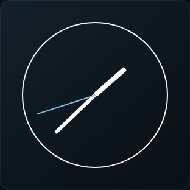

Analog clock face with hour / minute / second hands (self-sourcing).

- **Sensor:** none (self-sourcing)
- **Default size:** 120×120

| key | type | default | options / range | description |
| --- | --- | --- | --- | --- |
| `showSeconds` | toggle | true |  |  |
| `showTicks` | toggle | false |  |  |
| `showNumbers` | toggle | false |  |  |
| `showCap` | toggle | false |  |  |
| `updateMs` | number | 1000 | min 16, step 50 | redraw interval; lower = smoother second hand, higher = lighter |
| `color` | color |  |  | hour + minute hands, ticks, ring |
| `accent` | color |  |  |  |
| `face` | color |  |  | face fill (default transparent) |

### Button / Macro — `button`

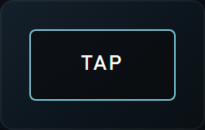

Pressable button that runs a macro of {domain, service, data} calls (HA services or media transport).

- **Sensor:** none (self-sourcing)
- **Default size:** 90×44
- **Interactive:** catches clicks in passive mode (per-widget click-through)

| key | type | default | options / range | description |
| --- | --- | --- | --- | --- |
| `label` | text | "tap" |  |  |
| `actions` | macro | [] |  | run these calls in order on press — domain/service like Home Assistant (put entity_id in data), or domain "media" for now-playing transport (playpause/next/previous) |

### CPU — `cpu`

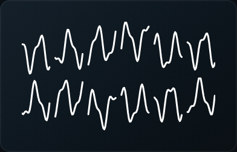

Self-sourcing CPU widget: a per-core sparkline grid or one combined gauge.

- **Sensor:** none (self-sourcing)
- **Default size:** 160×90

| key | type | default | options / range | description |
| --- | --- | --- | --- | --- |
| `mode` | select | "cores" | `cores`, `combined` | per-core sparkline grid vs one combined gauge |
| `cols` | number | 8 | min 1 | columns in the per-core grid (blank = 8; clamped to the core count) |
| `seconds` | number | 30 | min 5, step 5 | seconds of history to show |
| `histogram` | toggle |  |  | draw bars instead of lines |
| `lineWidth` | number |  | min 0.5, step 0.5 | per-core stroke thickness |
| `label` | text |  |  |  |
| `color` | color |  |  |  |

### Battery — `battery`

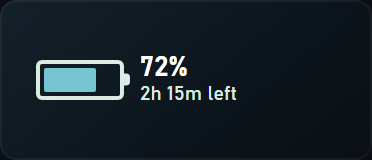

A battery indicator: charge icon, percent, and charging / time-remaining status (laptops; a desktop without a battery shows "—").

- **Sensor:** none (self-sourcing)
- **Default size:** 150×44

| key | type | default | options / range | description |
| --- | --- | --- | --- | --- |
| `showStatus` | toggle | true |  | show charging / time-remaining under the percent |
| `color` | color |  |  |  |

### GPU — `gpu`

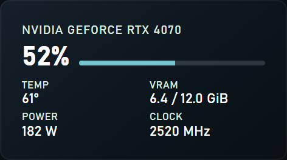

A GPU panel: card name, utilisation %, and the reported temp / VRAM / power / clock / fan (NVIDIA NVML; non-NVIDIA shows "—").

- **Sensor:** none (self-sourcing)
- **Default size:** 200×96

| key | type | default | options / range | description |
| --- | --- | --- | --- | --- |
| `showName` | toggle | true |  | show the GPU model header |
| `label` | text |  |  | replace the detected card name |
| `color` | color |  |  |  |

### Disks — `disks`

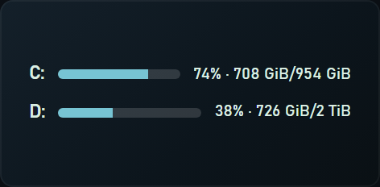

Storage usage: one bar per volume (used %, used/total), auto-discovering your drives. Near-full volumes warn.

- **Sensor:** none (self-sourcing)
- **Default size:** 200×80

| key | type | default | options / range | description |
| --- | --- | --- | --- | --- |
| `showBytes` | toggle | true |  | append used/total bytes after the percent |
| `color` | color |  |  |  |

### Top Process — `topproc`

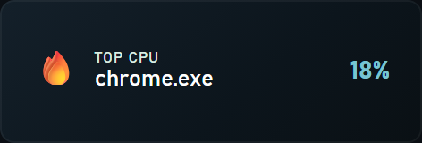

The busiest process by CPU %, RAM, disk I/O, or GPU VRAM — "what’s eating my machine". Each metric is sampled only while shown.

- **Sensor:** none (self-sourcing)
- **Default size:** 200×44

| key | type | default | options / range | description |
| --- | --- | --- | --- | --- |
| `by` | select | "cpu" | `cpu`, `mem`, `disk`, `gpu` | CPU %, RAM, disk I/O, or GPU VRAM (GPU needs NVIDIA/NVML) |
| `label` | text |  |  | header (defaults to "Top CPU" etc.) |
| `color` | color |  |  |  |

### Process Watcher — `procwatch`

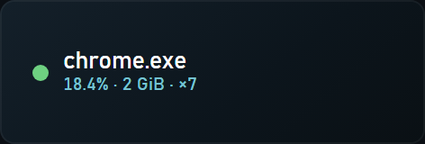

Watch a specific process by name: is it running, and its CPU % + RAM (summed across instances). Good for keeping an eye on one app (a game, a build, OBS).

- **Sensor:** none (self-sourcing)
- **Default size:** 200×44

| key | type | default | options / range | description |
| --- | --- | --- | --- | --- |
| `name` | text | "chrome.exe" |  | executable name, e.g. chrome.exe, obs64.exe, Spotify.exe |
| `label` | text |  |  | override the shown name (defaults to the process) |
| `color` | color |  |  |  |

### Connections — `netconn`

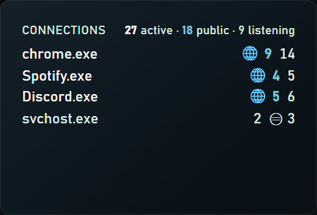

Active network connections by process: established + listening counts and how many go to a PUBLIC remote IP — so an unusual outbound connection stands out. Observability, not an IDS.

- **Sensor:** none (self-sourcing)
- **Default size:** 240×150

| key | type | default | options / range | description |
| --- | --- | --- | --- | --- |
| `showListening` | toggle | false |  | include processes that are only LISTENing (accepting inbound), not just active talkers |
| `maxRows` | number | 8 | min 1, max 20, step 1 | how many processes to list (busiest — most public — first) |
| `color` | color |  |  |  |

### Ping — `ping`

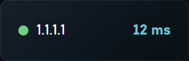

Ping a host (default 1.1.1.1) and show reachability + round-trip latency — a quick "is my internet up?" light. ICMP, no admin needed.

- **Sensor:** none (self-sourcing)
- **Default size:** 150×24
- **Intrinsic size:** `basis:"content"` shrink-wraps to the rendered content

| key | type | default | options / range | description |
| --- | --- | --- | --- | --- |
| `host` | text | "1.1.1.1" |  | IP or hostname to ping, e.g. 1.1.1.1 or cloudflare.com |
| `label` | text |  |  | override the shown name (defaults to the host) |
| `slowMs` | number | 150 | min 1, step 10 | latency at/above this is shown as "slow" (amber) |
| `color` | color |  |  |  |

### Wi-Fi — `wifi`

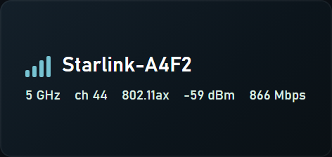

Wi-Fi link detail: SSID, signal strength, and band / channel / 802.11 generation / RSSI / link rate. Windows; shows "Not connected" off Wi-Fi.

- **Sensor:** none (self-sourcing)
- **Default size:** 200×76

| key | type | default | options / range | description |
| --- | --- | --- | --- | --- |
| `showDetail` | toggle | true |  | show band / channel / generation / RSSI / link rate under the SSID |
| `color` | color |  |  |  |

### Spectrum — `spectrum`

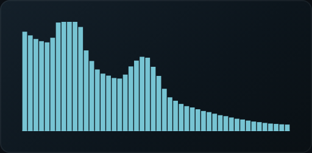

Self-sourcing audio spectrum (WASAPI loopback FFT): frequency bars or a scrolling spectrogram.

- **Sensor:** none (self-sourcing)
- **Default size:** 220×90

| key | type | default | options / range | description |
| --- | --- | --- | --- | --- |
| `device` | select | "" | (runtime list) — from `audioOutputs` | which audio output to visualise (blank = system default). App-wide: one capture stream per app, so the last spectrum widget to (re)start sets it for all |
| `mode` | select | "bars" | `bars`, `spectrogram` | frequency bars vs a scrolling spectrogram heatmap |
| `scale` | select | "log" | `log`, `linear` | log spreads the low frequencies (musical, default); linear is even Hz/bar. App-wide like device: shared by every spectrum widget |
| `pips` | toggle | false |  | gridline markers at 100 Hz / 1 kHz / 10 kHz |
| `bars` | number | 48 | min 8, max 128, step 1 | number of frequency bars (bars mode) |
| `gap` | number | 0.15 | min 0, max 0.9, step 0.05 | spacing between bars (0..1) |
| `color` | color |  |  | bars mode; defaults to the theme accent |

### Web Frame — `iframe`

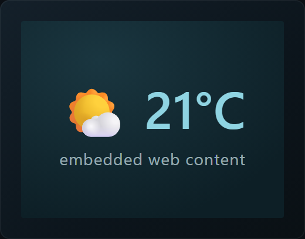

Embedded web page (self-hosted dashboards); optional click-through interactivity.

- **Sensor:** none (self-sourcing)
- **Default size:** 320×240
- **Interactive:** catches clicks in passive mode (per-widget click-through)

| key | type | default | options / range | description |
| --- | --- | --- | --- | --- |
| `url` | text | "" |  | bare domains get https://; only https:// loads (the CSP blocks plain http://); javascript:/data: are rejected |
| `refresh` | number | 0 | min 0, max 3600, step 5 | auto-reload interval in seconds (0 = never); reloads cost CPU/network |
| `scroll` | toggle | false |  | allow scrolling inside the frame |
| `interact` | toggle | false |  | off: clicks pass through to the desktop; on: the frame catches clicks (passive overlay only — dragging always works in edit mode) |
| `sandbox` | toggle | true |  | recommended: isolates the page (scripts only, no parent/popups/top-nav). Turn off only for a trusted page needing same-origin features (e.g. a Home Assistant login) |
| `referrerPolicy` | select | "no-referrer" | `no-referrer`, `origin`, `same-origin` | what Referer the embedded page sees (no-referrer leaks nothing) |
| `title` | text | "" |  | accessible label for the frame (screen readers / tooltip) |
| `timeoutMs` | number | 6000 | min 1000, max 30000, step 500 | how long to wait for a load before showing a 'blocked or unreachable' hint |

### Zone — `zone`


A landing zone: drag a window over it (hold Shift) to snap it here; optional match rule auto-arranges windows. Invisible on the live overlay; shown only while editing.

- **Sensor:** none (self-sourcing)
- **Default size:** 600×400

| key | type | default | options / range | description |
| --- | --- | --- | --- | --- |
| `matchExe` | text | "" |  | auto-arrange: snap a window of this exe here, e.g. Spotify.exe (blank = drag-only) |
| `matchClass` | text | "" |  | optional window-class glob refiner, e.g. Chrome_WidgetWin_1 |
| `matchTitle` | text | "" |  | optional title glob refiner, e.g. *Gmail* |

### Audio Switcher — `audioswitch`

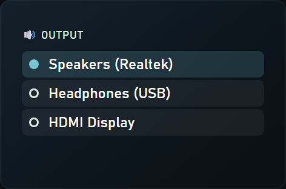

Switch the default audio output device with a tap — lists your speakers/headphones/HDMI outputs and marks the active one. Windows.

- **Sensor:** none (self-sourcing)
- **Default size:** 200×120
- **Interactive:** catches clicks in passive mode (per-widget click-through)

| key | type | default | options / range | description |
| --- | --- | --- | --- | --- |
| `color` | color |  |  |  |

### Recycle Bin — `recyclebin`

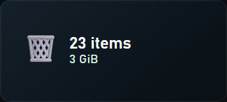

Recycle Bin contents: how many items and how much space they take, with a "needs emptying" cue past a size you set.

- **Sensor:** none (self-sourcing)
- **Default size:** 150×48

| key | type | default | options / range | description |
| --- | --- | --- | --- | --- |
| `warnGb` | number | 0 | min 0, step 1 | highlight when the bin reaches this many GB (0 = never) |
| `color` | color |  |  |  |

### Volume — `volume`

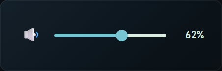

System master volume: a slider + mute toggle controlling the default output device. Windows.

- **Sensor:** none (self-sourcing)
- **Default size:** 190×36
- **Interactive:** catches clicks in passive mode (per-widget click-through)

| key | type | default | options / range | description |
| --- | --- | --- | --- | --- |
| `color` | color |  |  |  |

### Image — `image`

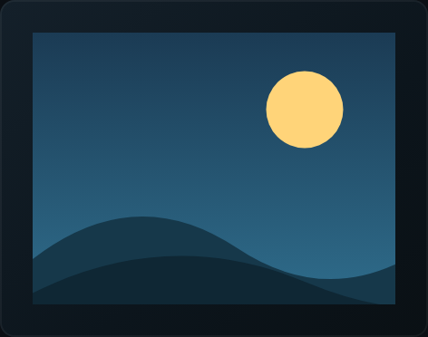

A static image / photo from a URL (https / data) or a filename in your wallpapers folder, with a fit mode.

- **Sensor:** none (self-sourcing)
- **Default size:** 200×150

| key | type | default | options / range | description |
| --- | --- | --- | --- | --- |
| `src` | text | "" |  | an image URL (https:// or data:), or a filename in your wallpapers folder |
| `fit` | select | "contain" | `contain`, `cover`, `fill`, `none` | how the image fills the box (contain = whole image, cover = fill + crop) |
| `alt` | text | "" |  | accessible description (screen readers) |

### Sticky Note — `note`

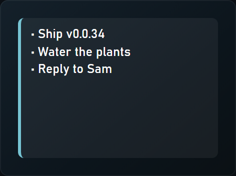

A sticky note / scratchpad: editable text that persists across restarts. Type on the live overlay; arrange it in the studio.

- **Sensor:** none (self-sourcing)
- **Default size:** 200×140
- **Interactive:** catches clicks in passive mode (per-widget click-through)

| key | type | default | options / range | description |
| --- | --- | --- | --- | --- |
| `placeholder` | text | "Notes…" |  | shown when the note is empty |
| `color` | color |  |  | the note’s left edge accent |

### Spacer — `spacer`

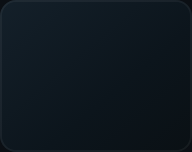

An invisible spacer: empty whitespace that occupies layout space to push other widgets apart. Shown only as a faint outline while editing.

- **Sensor:** none (self-sourcing)
- **Default size:** 60×40

_No configurable fields._


### Countdown — `countdown`

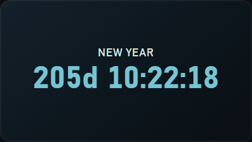

Counts down to a target date/time ("days until …"), or runs an auto-cycling Pomodoro work/break rhythm. Wall-clock driven (no start/pause — use Timer for that).

- **Sensor:** none (self-sourcing)
- **Default size:** 170×80
- **Intrinsic size:** `basis:"content"` shrink-wraps to the rendered content

| key | type | default | options / range | description |
| --- | --- | --- | --- | --- |
| `mode` | select | "event" | `event`, `pomodoro` | count down to a date, or run a repeating work/break rhythm |
| `target` | text | "" |  | event mode: a date/time, e.g. 2026-12-31 or 2026-12-31T18:00 |
| `format` | select | "auto" | `auto`, `dhms`, `hms`, `ms` | event display: auto trims units; dhms/hms/ms are fixed |
| `countUp` | toggle | false |  | event mode: once the target passes, count the time elapsed since (instead of stopping at 0) |
| `workMin` | number | 25 | min 1, step 1 | pomodoro work length |
| `breakMin` | number | 5 | min 1, step 1 | pomodoro break length |
| `label` | text | "" |  |  |
| `color` | color |  |  |  |

### Timer — `timer`

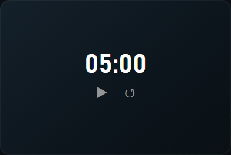

A countdown timer or stopwatch with start / pause / reset. A countdown can loop when it reaches zero. Pick the time format; the controls work on the overlay (interactive).

- **Sensor:** none (self-sourcing)
- **Default size:** 160×96
- **Interactive:** catches clicks in passive mode (per-widget click-through)

| key | type | default | options / range | description |
| --- | --- | --- | --- | --- |
| `mode` | select | "countdown" | `countdown`, `stopwatch` | count down from a duration, or up from zero |
| `duration` | number | 300 | min 0 | countdown length in seconds |
| `format` | select | "auto" | `auto`, `mm:ss`, `hh:mm:ss`, `ss` | time display format |
| `loop` | toggle | false |  | restart automatically when a countdown reaches zero |
| `label` | text | "" |  | header text |
| `color` | color | "" |  | text colour (blank = theme) |

### Monitor Switch — `monitorswitch`

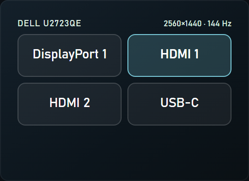

Switch a monitor’s input source (HDMI / DisplayPort / …) with a tap, over DDC/CI. Shows the current source and, optionally, the resolution + refresh rate. Requires DDC/CI enabled on the monitor; input codes are vendor-specific (auto-detected). Windows.

- **Sensor:** none (self-sourcing)
- **Default size:** 220×150
- **Interactive:** catches clicks in passive mode (per-widget click-through)

| key | type | default | options / range | description |
| --- | --- | --- | --- | --- |
| `monitor` | select |  | (runtime list) — from `displayNames` | which monitor to control (blank = the primary monitor) |
| `sources` | monitorSources |  |  | pick which inputs to show, rename them (e.g. HDMI 2 → Switch 2), and optionally pair each with a monitor speaker volume (0–100) that is set just before switching to it; blank = show all detected |
| `label` | text |  |  | title override (blank = the monitor’s name) |
| `showCurrent` | toggle | true |  | highlight the currently-selected input |
| `showStats` | toggle | false |  | show the current resolution + refresh rate |
| `compact` | toggle | false |  | show a compact list instead of large touch buttons |
| `color` | color |  |  |  |

### HA Sensor — `ha.sensor`

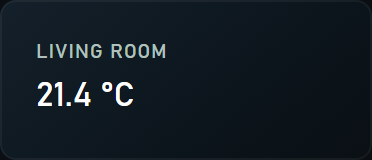

- **Sensor:** binds a `json` sensor
- **Default size:** 150×44

| key | type | default | options / range | description |
| --- | --- | --- | --- | --- |
| `label` | text |  |  |  |

### HA Binary Sensor — `ha.binary_sensor`

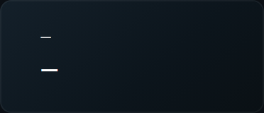

- **Sensor:** binds a `json` sensor
- **Default size:** 150×44

| key | type | default | options / range | description |
| --- | --- | --- | --- | --- |
| `label` | text |  |  |  |

### HA Light — `ha.light`

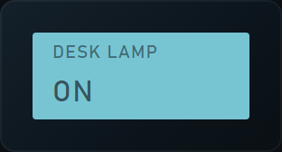

- **Sensor:** binds a `json` sensor
- **Default size:** 120×48
- **Interactive:** catches clicks in passive mode (per-widget click-through)

| key | type | default | options / range | description |
| --- | --- | --- | --- | --- |
| `label` | text |  |  |  |
| `showBrightness` | toggle | true |  |  |

### HA Switch — `ha.switch`

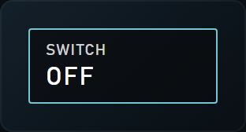

- **Sensor:** binds a `json` sensor
- **Default size:** 120×48
- **Interactive:** catches clicks in passive mode (per-widget click-through)

| key | type | default | options / range | description |
| --- | --- | --- | --- | --- |
| `label` | text |  |  |  |

### HA Fan — `ha.fan`

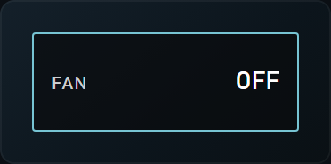

- **Sensor:** binds a `json` sensor
- **Default size:** 150×56
- **Interactive:** catches clicks in passive mode (per-widget click-through)

| key | type | default | options / range | description |
| --- | --- | --- | --- | --- |
| `label` | text |  |  |  |
| `showSpeed` | toggle | true |  |  |
| `showOscillate` | toggle | true |  |  |

### HA Climate / A-C — `ha.climate`

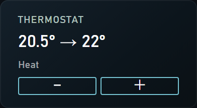

- **Sensor:** binds a `json` sensor
- **Default size:** 170×92
- **Interactive:** catches clicks in passive mode (per-widget click-through)

| key | type | default | options / range | description |
| --- | --- | --- | --- | --- |
| `label` | text |  |  |  |
| `showMode` | toggle | true |  |  |
| `showTemp` | toggle | true |  |  |
| `showFan` | toggle | true |  |  |

### HA Cover — `ha.cover`

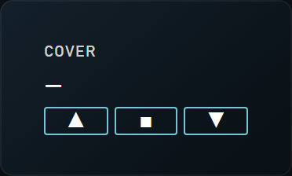

- **Sensor:** binds a `json` sensor
- **Default size:** 150×76
- **Interactive:** catches clicks in passive mode (per-widget click-through)

| key | type | default | options / range | description |
| --- | --- | --- | --- | --- |
| `label` | text |  |  |  |
| `showButtons` | toggle | true |  |  |
| `showPosition` | toggle | true |  |  |

### HA Lock — `ha.lock`

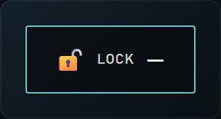

- **Sensor:** binds a `json` sensor
- **Default size:** 120×48
- **Interactive:** catches clicks in passive mode (per-widget click-through)

| key | type | default | options / range | description |
| --- | --- | --- | --- | --- |
| `label` | text |  |  |  |

### HA Scene — `ha.scene`

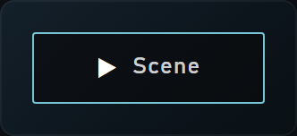

- **Sensor:** binds a `json` sensor
- **Default size:** 130×40
- **Interactive:** catches clicks in passive mode (per-widget click-through)

| key | type | default | options / range | description |
| --- | --- | --- | --- | --- |
| `label` | text |  |  |  |

### HA Input — `ha.input`

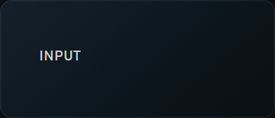

- **Sensor:** binds a `json` sensor
- **Default size:** 160×48
- **Interactive:** catches clicks in passive mode (per-widget click-through)

| key | type | default | options / range | description |
| --- | --- | --- | --- | --- |
| `label` | text |  |  |  |

### HA Media Player — `ha.media_player`

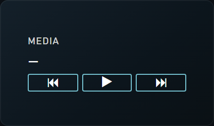

- **Sensor:** binds a `json` sensor
- **Default size:** 180×92
- **Interactive:** catches clicks in passive mode (per-widget click-through)

| key | type | default | options / range | description |
| --- | --- | --- | --- | --- |
| `label` | text |  |  |  |
| `showTransport` | toggle | true |  |  |
| `showVolume` | toggle | true |  |  |

### Now Playing — `nowplaying`

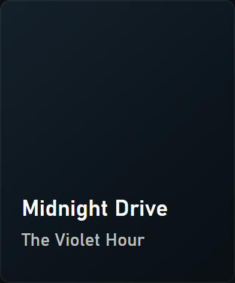

- **Sensor:** none (self-sourcing)
- **Default size:** 160×200
- **Interactive:** catches clicks in passive mode (per-widget click-through)

| key | type | default | options / range | description |
| --- | --- | --- | --- | --- |
| `label` | text |  |  |  |

### Stock Ticker — `ticker`

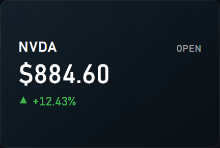

- **Sensor:** none (self-sourcing)
- **Default size:** 180×110

| key | type | default | options / range | description |
| --- | --- | --- | --- | --- |
| `symbol` | text | "NVDA" |  | e.g. AAPL, SPY, BTC-USD — must be in the Stocks plugin’s symbol list |
| `label` | text | "" |  | header text (defaults to the symbol) |
| `decimals` | number | 2 |  | price decimal places |
| `showSparkline` | toggle | true |  | show the intraday mini-chart |
| `invertColors` | toggle | false |  | red = up, green = down (East-Asian-market convention) |

### Weather — `weather`

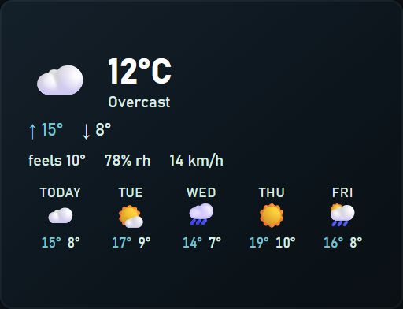

- **Sensor:** none (self-sourcing)
- **Default size:** 220×160

| key | type | default | options / range | description |
| --- | --- | --- | --- | --- |
| `showHiLo` | toggle | true |  |  |
| `showDetail` | toggle | true |  |  |
| `forecastDays` | number | 5 | min 0, max 7, step 1 | how many days of forecast to show below (0 = off; up to 7) |
| `color` | color |  |  |  |

### Sun & Moon — `sunmoon`

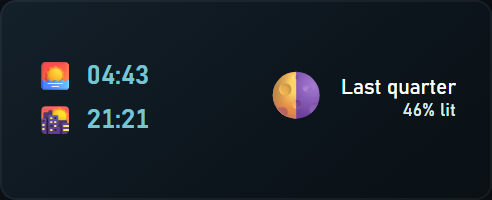

Today’s sunrise + sunset (from your weather location) and the current moon phase with illumination.

- **Sensor:** none (self-sourcing)
- **Default size:** 210×64

| key | type | default | options / range | description |
| --- | --- | --- | --- | --- |
| `showSun` | toggle | true |  |  |
| `showMoon` | toggle | true |  |  |
| `color` | color |  |  |  |

### Air Quality — `airquality`

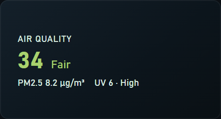

European Air Quality Index with a colour-coded band, plus PM2.5 and the UV index — for your weather location.

- **Sensor:** none (self-sourcing)
- **Default size:** 190×86

| key | type | default | options / range | description |
| --- | --- | --- | --- | --- |
| `showPm` | toggle | true |  |  |
| `showUv` | toggle | true |  |  |
| `color` | color |  |  |  |

### RSS — `rss`

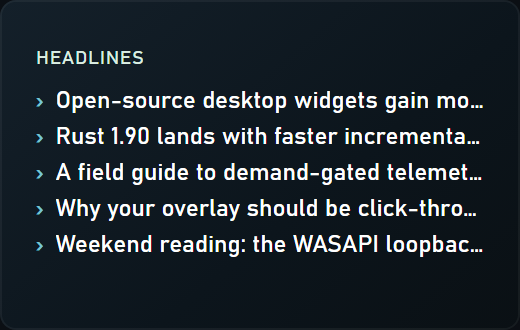

A list of headlines from your configured RSS / Atom feed.

- **Sensor:** none (self-sourcing)
- **Default size:** 260×150

| key | type | default | options / range | description |
| --- | --- | --- | --- | --- |
| `title` | text | "" |  | optional title above the list |
| `maxRows` | number | 8 | min 1, max 30, step 1 | how many headlines to show |
| `color` | color |  |  |  |

### Agenda — `agenda`

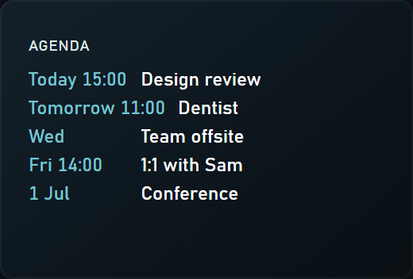

Your upcoming calendar events from a configured ICS feed.

- **Sensor:** none (self-sourcing)
- **Default size:** 240×150

| key | type | default | options / range | description |
| --- | --- | --- | --- | --- |
| `title` | text | "" |  | optional title above the list |
| `maxRows` | number | 6 | min 1, max 20, step 1 | how many upcoming events to show |
| `color` | color |  |  |  |

### AI Briefing — `assistant`


A self-updating, LLM-generated briefing from your live sensors. Configure the prompt and a schedule (interval like 5m, or a cron expression). Auto-refreshes on the overlay; manual refresh in the studio. Needs an AI provider configured.

- **Sensor:** none (self-sourcing)
- **Default size:** 280×96
- **Interactive:** catches clicks in passive mode (per-widget click-through)

| key | type | default | options / range | description |
| --- | --- | --- | --- | --- |
| `prompt` | text | "Summarize my system status in one short, friendly sentence." |  | what to ask the AI (your live sensors are included automatically) |
| `schedule` | text | "10m" |  | how often to refresh: an interval (30s, 5m, 2h), a cron expr (e.g. 0 9 * * *), or "manual" |
| `sensors` | text | "auto" |  | comma-separated sensor ids to feed the prompt, or "auto" |
| `speak` | toggle | false |  | speak each update (TTS) |
| `label` | text | "AI" |  | header text |
| `color` | color | "" |  | text colour (blank = theme) |

### Transcribe / Translate — `transcribe`


Push-to-talk speech-to-text, optionally translated to another language and read aloud, via the AI provider. Click the mic to record, click again to stop and transcribe. Needs an OpenAI-compatible provider (Whisper) configured.

- **Sensor:** none (self-sourcing)
- **Default size:** 320×120
- **Interactive:** catches clicks in passive mode (per-widget click-through)

| key | type | default | options / range | description |
| --- | --- | --- | --- | --- |
| `mode` | select | "transcribe" | `transcribe`, `translate` | transcribe speech, or transcribe then translate. Click the mic to talk (push-to-talk — never always-listening). |
| `targetLang` | text | "English" |  | target language for translate mode (e.g. English, Spanish, 日本語) |
| `sourceLang` | text | "auto" |  | a hint for accuracy, or "auto" to detect (e.g. auto, en, ja, es) |
| `audioSource` | select | "" | (runtime list) — from `microphones` | which microphone to record from (blank = system default) |
| `model` | text | "" |  | blank = provider default (whisper-1); e.g. gpt-4o-transcribe, gpt-4o-mini-transcribe |
| `speak` | toggle | false |  | speak the result (TTS) |
| `label` | text | "" |  | header text |
| `color` | color | "" |  | text colour (blank = theme) |
